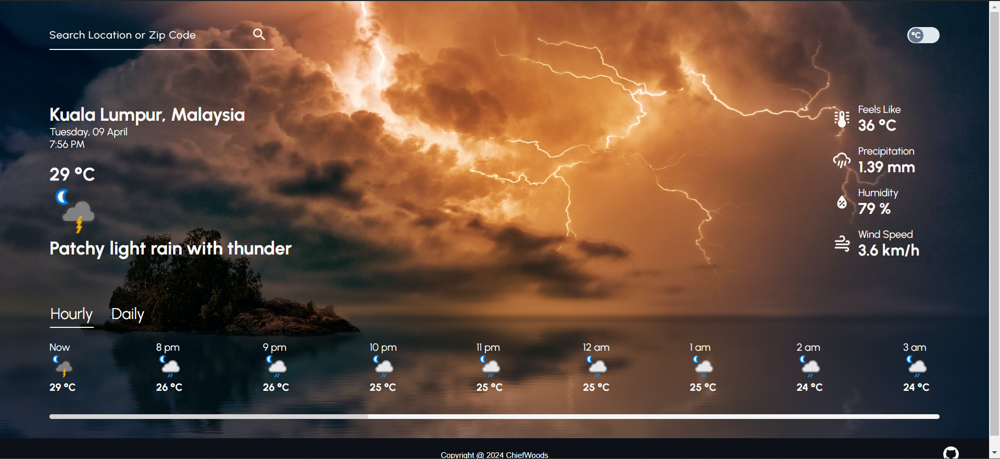

# Weather App



Weather forecast site for [The Odin Project](https://www.theodinproject.com/).

[Live Website](https://chiefwoods.github.io/weather-app/)  

[Source Repository](https://github.com/ChiefWoods/weather-app)

## Features

- Get weather forecasts by searching city, state, country or a combination of any
- Toggle between metric and imperial systems
- Display weather data including 'Feels Like', 'Precipitation', 'Humidity', 'Wind Speed'
- Display forecasts up to next 24 hours and 3 days

## Built With

### Languages

- [](https://html5.org/)
- [](https://www.w3.org/Style/CSS/Overview.en.html)
- [](https://js.org/index.html)
- [](https://webpack.js.org/)
- [](https://eslint.org/)

### Libraries

- [date-fns](https://date-fns.org/)

### Tools

- [](https://code.visualstudio.com/)

## Getting Started

### Prerequisites

Update your npm package to the latest version.
```
npm install npm@latest -g
```

### Setup

1. Clone the repository
```
git clone https://github.com/ChiefWoods/weather-app.git
```
2. Install all dependencies
```
npm install
```
3. Bundle code
```
npx webpack
```

## Issues

View the [open issues](https://github.com/ChiefWoods/weather-app/issues) for a full list of proposed features and known bugs.

## Acknowledgements

### Resources

- [Shields.io](https://shields.io/)
- [Google Fonts](https://fonts.google.com/)
- [Pictogrammers](https://pictogrammers.com/)
- [Pexels](https://www.pexels.com/)
- [Unsplash](https://unsplash.com/)

### Hosting and API

- [GitHub Pages](https://pages.github.com/)
- [Weather API](https://www.weatherapi.com/)

## Contact

[chii.yuen@hotmail.com](mailto:chii.yuen@hotmail.com)